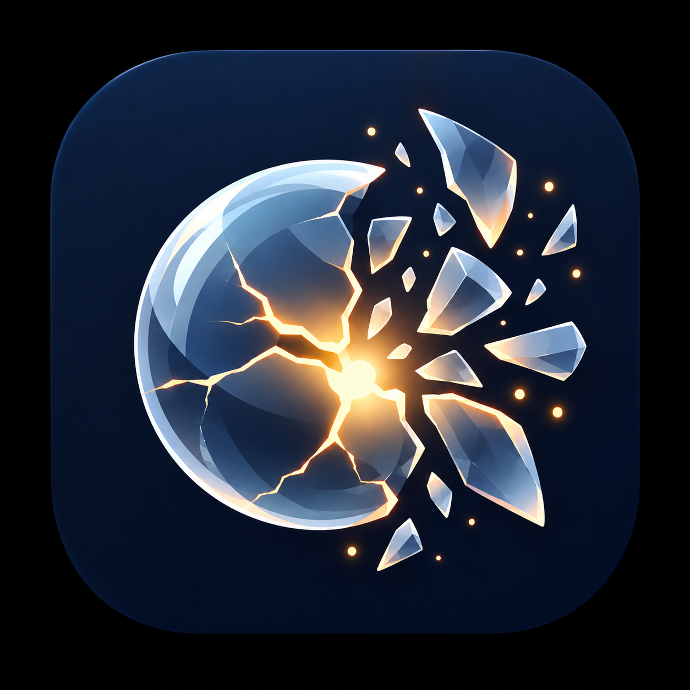

<div align="center">

  

  # ENOUGH
  ### *A Sensory Release Ritual Crafted with Flutter*

  <p align="center">
    <b>No stats. No streaks. No tracking. Just permission to let go.</b>
  </p>

  [](https://flutter.dev)
  [](https://dart.dev)
  [](LICENSE)
  [](https://flutter.dev)

</div>

---

## 🔮 Overview

**ENOUGH** is a mindful digital artifact that translates emotional weight into tactile, physics-driven interaction. Instead of endless questionnaires or gamified counters, the app provides a singular, cathartic moment:

1. **Infuse your burden** directly into the core of a living, breathing crystal sphere.
2. **Deform, strain, and fracture** the sphere with fluid touch mechanics and device tilt.
3. **Shatter the tension** completely with realistic shards, heavy haptics, and spatial audio.
4. **Rest in the aftermath**—stirring glowing stardust embers in a guided breathing space.

---

## ⚡ Key Highlights & Architecture

| Feature | Visual / Technical Execution | Sensory Impact |
| :--- | :--- | :--- |
| **🪞 3D Gyroscope Parallax** | `sensors_plus` filtered accelerometer stream dynamically shifts the inner core specular highlight & halo | Real-time physical depth responding to device orientation |
| **🫧 Viscous Elastic Deformation** | Custom 40-step circular path trigonometric distortion towards finger touch point | The sphere yields and dents like liquid glass under pressure |
| **✍️ Thought Imprint** | Captures thoughts / burdens and renders them locked inside the crystalline nucleus | Emotional investment: watching your exact worry explode |
| **💥 Catastrophic Detonation** | 28 individual polygonal shards computed with ease-out cubic velocity and independent rotational vectors | Instantaneous visual catharsis backed by an incisive white flash |
| **⚡ Micro-Haptic Sequence** | Escalating vibration loop (`selectionClick` $\rightarrow$ `mediumImpact` $\rightarrow$ `heavyPulse`) | Simulates microscopic glass fibers snapping under tension |
| **✨ Interactive Stardust Aftermath** | 35 floating particles that gravitate and swirl toward your touch on the closure screen | A peaceful, tactile playground after the explosion |

---

## 📸 Experience Walkthrough

<div align="center">

| Phase 1: The Weight | Phase 2: The Shatter | Phase 3: The Calm |
| :---: | :---: | :---: |
|  |  |  |
| *Imprint burden & build strain* | *Catastrophic 3D crystal fracture* | *Interactive stardust & breathing guide* |

</div>

---

## 🛠️ Tech Stack & Dependencies

| Category | Technology | Purpose |
| :--- | :--- | :--- |
| **Framework** | Flutter (Material 3) | Cross-platform UI engine |
| **Graphics Engine** | CustomPainter / Pure Canvas | Custom math for glass deformation & particle vectors |
| **Motion Sensors** | [`sensors_plus`](https://pub.dev/packages/sensors_plus) | Accelerometer/gyroscope hardware stream |
| **Audio** | [`audioplayers`](https://pub.dev/packages/audioplayers) | Shatter detonation & quiet closure chime cues |
| **Local State** | [`shared_preferences`](https://pub.dev/packages/shared_preferences) | Mindful once-a-day ritual persistence |
| **Typography** | [`google_fonts`](https://pub.dev/packages/google_fonts) | DM Serif Display, DM Sans & Space Mono |

---

## 📂 Project Structure

```text
lib/
├── main.dart                          # App bootstrapping & service initialization
├── app/
│   └── enough_app.dart                # Theme configuration & immersive full-screen setup
├── core/
│   ├── constants/
│   │   ├── app_colors.dart            # Ink, porcelain, glass lilac, and warm candlelight tokens
│   │   └── app_durations.dart         # Organic timing curves & transition timings
│   └── services/
│       ├── day_guard_service.dart     # Once-per-day gentle mindful guard
│       ├── haptic_service.dart        # Tactile strain & heavy pulse feedback
│       ├── sound_service.dart         # Shatter & closure chime audio manager
│       └── tilt_service.dart          # Low-pass filtered device accelerometer provider
└── features/
    └── enough/
        ├── screens/
        │   ├── entry_screen.dart      # Living crystal sphere, imprint dialog, detonation
        │   └── closure_screen.dart    # Guided breathing aura & interactive stardust embers
        └── widgets/
            ├── film_grain.dart        # Animated noise layer preventing digital color banding
            ├── floating_dust.dart     # Ambient particle drift
            ├── heavy_button.dart      # Tactile CTA button with weighted micro-scaling
            └── soft_vignette.dart     # Radial edge darkening overlay
```

---

## 🚀 Getting Started

### Prerequisites
* Flutter SDK `^3.10.3` or newer
* Android Studio / VS Code
* Physical device recommended (to experience gyroscope parallax and micro-haptics)

### Installation

1. **Clone the repository:**
   ```bash
   git clone https://github.com/your-username/enough.git
   cd enough
   ```

2. **Install dependencies:**
   ```bash
   flutter pub get
   ```

3. **Run on connected device:**
   ```bash
   flutter run
   ```

---

## 📄 License

This project is licensed under the **MIT License** — see the [LICENSE](LICENSE) file for details. You are completely free to use, modify, distribute, and build upon this project.
