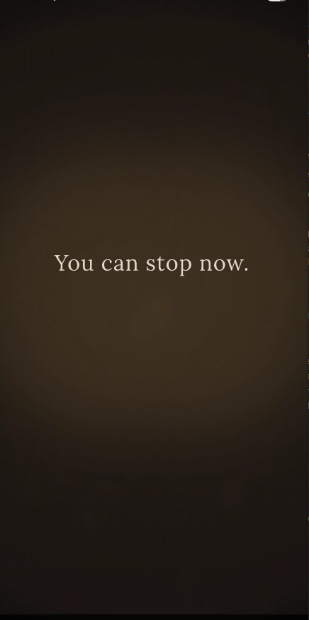
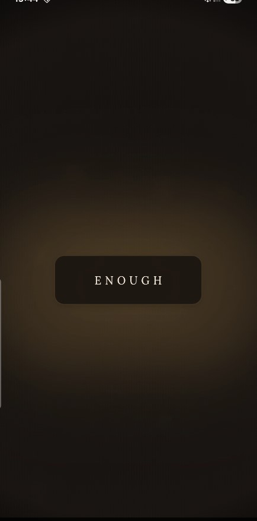
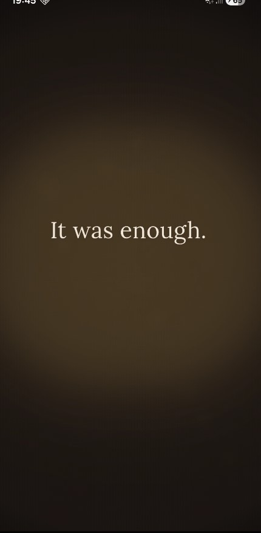
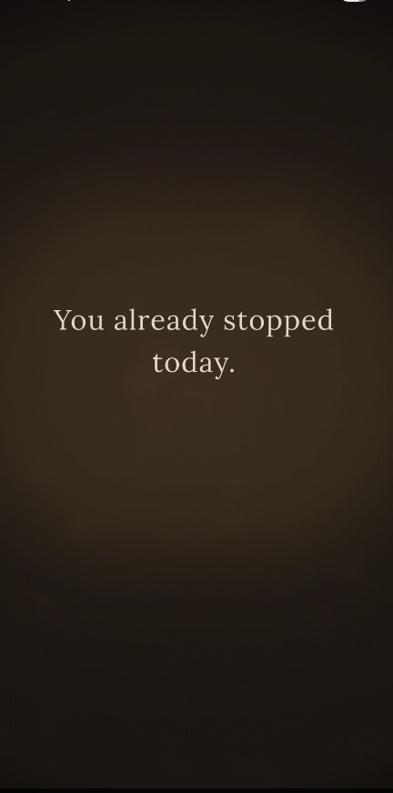

# ENOUGH

<div align="center">
  <h3>A Ritual of Closure.</h3>
  <p><i>ENOUGH gives you permission to stop — once per day.</i></p>
</div>

---

<div align="center">
  
  
  
  
</div>

---

## 🧘 Philosophy

ENOUGH is not a tool. It is a declaration. In a world designed to keep you scrolling, ENOUGH provides the finality of an ending.

- **One line per screen** — Silence after the sentence provides the weight.
- **No Reassurance** — Reassurance implies doubt. ENOUGH is certain.
- **No Future Framing** — ENOUGH ends. It does not transition you to "tomorrow."
- **No Settings** — Permission is not customizable.

---

## 💎 Ritual Features (The Soul)

We have surgically injected "life" into this minimal experience to ensure it feels physical, heavy, and intentional.

### 🎭 Soul Infusion Pass
- **Anticipation (The Empty Time)**: 1.4s of absolute silence and brightening before the first word appears.
- **Human Alignment**: Breaking the machine. All text and buttons are shifted slightly off-center to create organic tension.
- **Subconscious Breathing**: An ultra-slow 45-second gradient drift that keeps the screen alive.

### 🦾 Physical Presence
- **Haptic Rising**: The main button builds haptic pressure as you hold it, requiring a deliberate "breakthrough" to confirm.
- **Button Resistance**: A precise 300ms action delay and 2px compression makes the interaction feel like closing a heavy door.
- **Organic Curves**: Transitions use mass and momentum physics (Cubic 0.2, 0, 0, 1) instead of linear math.

### 🌑 Atmospheric Depth
- **Film Grain Overlay**: A micro-thin layer of animated noise removes digital banding and adds a "paper" texture.
- **Safety Core**: A soft amber glow radiates behind terminal text to signal safety to the nervous system.
- **Deep Stillness**: After 5 minutes on the closure screen, the app silently fades to 100% black to nudge you away from the screen.

---

## 🛠️ Tech Stack

- **Core**: Flutter (Material 3)
- **Typography**: [Lora](https://fonts.google.com/specimen/Lora) (Google Fonts)
- **Audio**: `audioplayers` (Custom Closure Chime)
- **Persistance**: `shared_preferences` (The Daily Guard)
- **Feedback**: Custom Haptic Layer

---

## 🚀 Setup

1. **Clone the repository**
   ```bash
   git clone https://github.com/Maher-Tec/enough.git
   ```

2. **Install dependencies**
   ```bash
   flutter pub get
   ```

3. **Add Audio Asset**
   Place your `closure_chime.mp3` in `assets/audio/`.

4. **Run**
   ```bash
   flutter run
   ```

---

<div align="center">
  <p><i>It was enough.</i></p>
</div>
